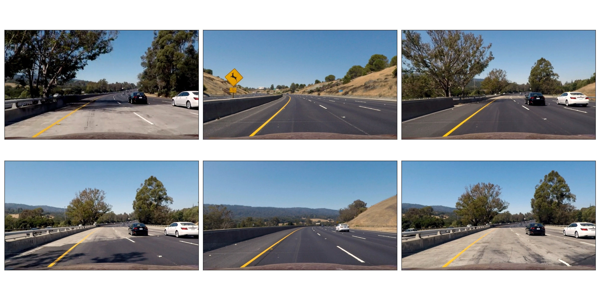
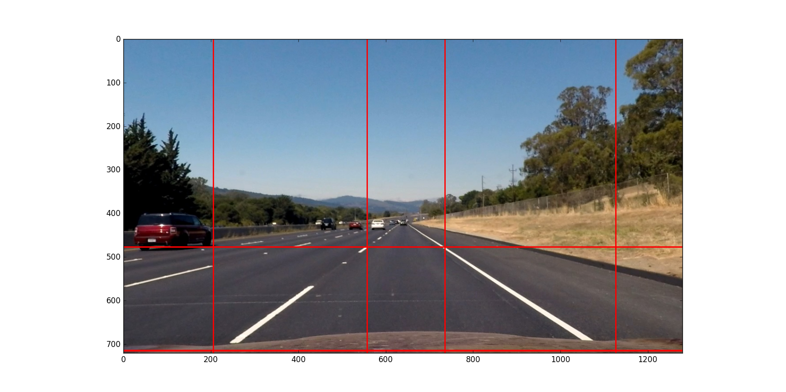
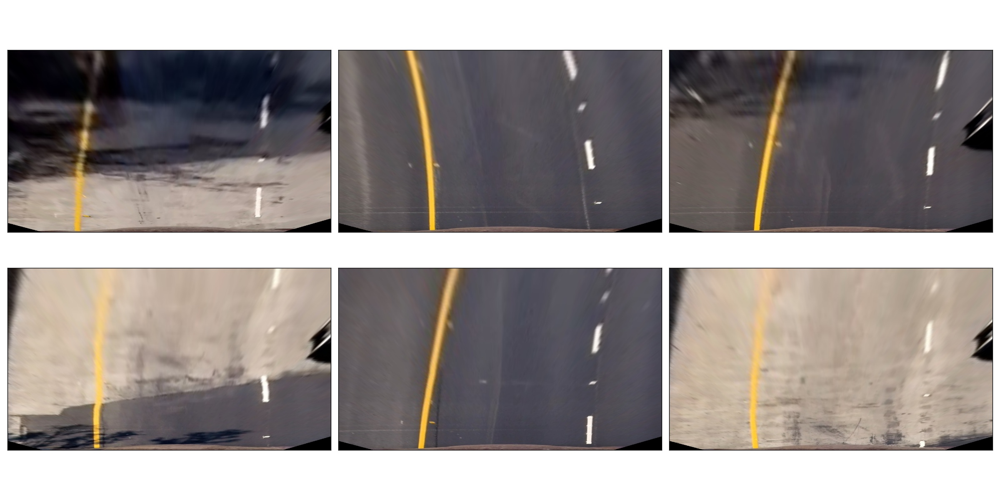

# Introduction

# Methods

The goals / steps of this project are the following:

-   Compute the camera calibration matrix and distortion coefficients
    given a set of chessboard images.
-   Apply a distortion correction to raw images.
-   Use color transforms, gradients, etc., to create a thresholded
    binary image.
-   Apply a perspective transform to rectify binary image ("birds-eye
    view").
-   Detect lane pixels and fit to find the lane boundary.
-   Determine the curvature of the lane and vehicle position with
    respect to center.
-   Warp the detected lane boundaries back onto the original image.
-   Output visual display of the lane boundaries and numerical
    estimation of lane curvature and vehicle position.

## Setup

    from collections import deque
    from itertools import groupby, islice, zip_longest, cycle, filterfalse
    from matplotlib.collections import PatchCollection
    from matplotlib.patches import Polygon
    from matplotlib.widgets import Button
    from matplotlib.widgets import Slider, Button, RadioButtons
    from moviepy.editor import VideoFileClip
    from mpl_toolkits.axes_grid1 import ImageGrid
    import cProfile
    import cv2
    import glob
    import matplotlib
    import matplotlib.image as mpimg
    import matplotlib.pyplot as plt
    import numpy as np
    import pdb

## Preprocessing

### Camera Calibration

    def measure_distortion(calibration_files):
        files = calibration_files
        objp = np.zeros((9*6,3), np.float32)
        objp[:,:2] = np.mgrid[0:9,0:6].T.reshape(-1,2)
        stage1 = map(lambda x: (x,), cycle(files))
        stage2 = map(lambda x: x + (mpimg.imread(x[0]),), stage1)
        stage3 = map(lambda x: x + (cv2.findChessboardCorners(cv2.cvtColor(x[1], cv2.COLOR_RGB2GRAY), (9,6)),), stage2)
        stage4 = map(lambda x: x + (cv2.drawChessboardCorners(np.copy(x[1]), (9,6), *(x[2][::-1])),), stage3)
        filenames,images,corners,annotated_images = zip(*filter(lambda x: x[2][0], islice(stage4, len(files))))
        _,imgpoints = zip(*corners)
        objpoints = [objp for i in range(len(imgpoints))]
        ret, mtx, dist, rvecs, tvecs = cv2.calibrateCamera(objpoints, imgpoints, list(islice(stage2,1))[0][1].shape[:2:][::-1], None, None)
        return mtx, dist, zip(filenames, annotated_images)

### Distortion Correction

    def get_undistorter(calibration_files):
        mtx,dist,annotated_images = measure_distortion(calibration_files)
        return lambda x: cv2.undistort(x, mtx, dist, None, mtx), annotated_images

    undistort,annotated_images = get_undistorter(glob.glob("camera_cal/*.jpg"))
    fig = plt.figure()
    grid = ImageGrid(fig, 111, nrows_ncols=(4,4), axes_pad=0.0)
    
    for p in zip(annotated_images, grid):
        p[1].imshow(p[0][1])
    
    fig.savefig("output_images/annotated_calibration_images.jpg")

    def visualize(filename, a):
        fig, axes = plt.subplots(2,3,figsize=(24,12),subplot_kw={'xticks':[],'yticks':[]})
        fig.subplots_adjust(hspace=0.03, wspace=0.05)
        for p in zip(sum(axes.tolist(),[]), a):
            p[0].imshow(p[1],cmap='gray')
        plt.tight_layout()
        fig.savefig(filename)
        plt.close()

    visualize("output_images/test_images.jpg",
              (mpimg.imread(f) for f in cycle(glob.glob("test_images/test*.jpg"))))

    visualize("output_images/undistorted_test_images.jpg",
              (undistort(mpimg.imread(f)) for f in cycle(glob.glob("test_images/test*.jpg"))))

### Perspective Measurement

    def measure_warp(img):
        top = 0
        bottom = img.shape[0]
        def handler(e):
            if len(src)<4:
                plt.axhline(int(e.ydata), linewidth=2, color='r')
                plt.axvline(int(e.xdata), linewidth=2, color='r')
                src.append((int(e.xdata),int(e.ydata)))
            if len(src)==4:
                dst.extend([(300,bottom),(300,top),(980,top),(980,bottom)])
        was_interactive = matplotlib.is_interactive()
        if not matplotlib.is_interactive():
            plt.ion()
        fig = plt.figure()
        plt.imshow(img)
        global src
        global dst
        src = []
        dst = []
        cid1 = fig.canvas.mpl_connect('button_press_event', handler)
        cid2 = fig.canvas.mpl_connect('close_event', lambda e: e.canvas.stop_event_loop())
        fig.canvas.start_event_loop(timeout=-1)
        M = cv2.getPerspectiveTransform(np.asfarray(src, np.float32), np.asfarray(dst, np.float32))
        Minv = cv2.getPerspectiveTransform(np.asfarray(dst, np.float32), np.asfarray(src, np.float32))
        matplotlib.interactive(was_interactive)
        return M, Minv

    def get_warpers(corrected_image):
        M, Minv = measure_warp(corrected_image)
        return lambda x: cv2.warpPerspective(x, M, x.shape[:2][::-1], flags=cv2.INTER_LINEAR), lambda x: cv2.warpPerspective(x, Minv, x.shape[:2][::-1], flags=cv2.INTER_LINEAR), M, Minv

    warp,unwarp,M,Minv = get_warpers(undistort(mpimg.imread("test_images/straight_lines2.jpg")))

    visualize("output_images/warped_undistorted_test_images.jpg",
              (warp(undistort(mpimg.imread(f))) for f in cycle(glob.glob("test_images/test*.jpg"))))

## Pipeline

### Gradient and Color Thresholds

    def scale(img, factor=255.0):
        scale_factor = np.max(img)/factor
        return (img/scale_factor).astype(np.uint8)

    def derivative(img, sobel_kernel=3):
        derivx = np.absolute(cv2.Sobel(img, cv2.CV_64F, 1, 0, ksize=sobel_kernel))
        derivy = np.absolute(cv2.Sobel(img, cv2.CV_64F, 0, 1, ksize=sobel_kernel))
        gradmag = np.sqrt(derivx**2 + derivy**2)
        absgraddir = np.arctan2(derivy, derivx)
        return scale(derivx), scale(derivy), scale(gradmag), absgraddir

    def grad(img, k1=3, k2=15):
        _,_,g,_ = derivative(img, sobel_kernel=k1)
        _,_,_,p = derivative(img, sobel_kernel=k2)
        return g,p

    def hls_select(img):
        hsv = cv2.cvtColor(img, cv2.COLOR_RGB2HLS).astype(np.float)
        h = hsv[:,:,0]
        l = hsv[:,:,1]
        s = hsv[:,:,2]
        return h,l,s

    def rgb_select(img):
        rgb = img
        r = rgb[:,:,0]
        g = rgb[:,:,1]
        b = rgb[:,:,2]
        return r,g,b

    def threshold(img, thresh_min=0, thresh_max=255):
        binary_output = np.zeros_like(img)
        binary_output[(img >= thresh_min) & (img <= thresh_max)] = 1
        return binary_output

    land = lambda *x: np.logical_and.reduce(x)
    lor = lambda *x: np.logical_or.reduce(x)

    def highlight(img):
        r,g,b = rgb_select(img)
        h,l,s = hls_select(img)
        o01 = threshold(r, 200, 255)
        o02 = threshold(g, 200, 255)
        o03 = threshold(s, 200, 255)
        return scale(lor(land(o01,o02),o03))

    visualize("output_images/binary_undistorted_test_images.jpg",
              (highlight(undistort(mpimg.imread(f))) for f in cycle(glob.glob("test_images/test*.jpg"))))

### Perspective Transform

    visualize("output_images/warped_binary_undistorted_images.jpg",
              (warp(highlight(undistort(mpimg.imread(f)))) for f in cycle(glob.glob("test_images/test*.jpg"))))

### Lane-Finding

    def detect_lines_sliding_window(warped_binary):
        # Assuming you have created a warped binary image called "warped_binary"
        # Take a histogram of the bottom half of the image
        histogram = np.sum(warped_binary[warped_binary.shape[0]/2:,:], axis=0)
        # Create an output image to draw on and  visualize the result
        out_img = np.dstack((warped_binary, warped_binary, warped_binary))*255
        # Find the peak of the left and right halves of the histogram
        # These will be the starting point for the left and right lines
        midpoint = np.int(histogram.shape[0]/2)
        leftx_base = np.argmax(histogram[:midpoint])
        rightx_base = np.argmax(histogram[midpoint:]) + midpoint
        # Choose the number of sliding windows
        nwindows = 9
        # Set height of windows
        window_height = np.int(warped_binary.shape[0]/nwindows)
        # Identify the x and y positions of all nonzero pixels in the image
        nonzero = warped_binary.nonzero()
        nonzeroy = np.array(nonzero[0])
        nonzerox = np.array(nonzero[1])
        # Current positions to be updated for each window
        leftx_current = leftx_base
        rightx_current = rightx_base
        # Set the width of the windows +/- margin
        margin = 100
        # Set minimum number of pixels found to recenter window
        minpix = 50
        # Create empty lists to receive left and right lane pixel indices
        left_lane_inds = []
        right_lane_inds = []
        # Step through the windows one by one
        for window in range(nwindows):
            # Identify window boundaries in x and y (and right and left)
            win_y_low = warped_binary.shape[0] - (window+1)*window_height
            win_y_high = warped_binary.shape[0] - window*window_height
            win_xleft_low = leftx_current - margin
            win_xleft_high = leftx_current + margin
            win_xright_low = rightx_current - margin
            win_xright_high = rightx_current + margin
            # Draw the windows on the visualization image
            cv2.rectangle(out_img,(win_xleft_low,win_y_low),(win_xleft_high,win_y_high),(0,255,0), 2) 
            cv2.rectangle(out_img,(win_xright_low,win_y_low),(win_xright_high,win_y_high),(0,255,0), 2) 
            # Identify the nonzero pixels in x and y within the window
            good_left_inds = ((nonzeroy >= win_y_low) & (nonzeroy < win_y_high) & (nonzerox >= win_xleft_low) & (nonzerox < win_xleft_high)).nonzero()[0]
            good_right_inds = ((nonzeroy >= win_y_low) & (nonzeroy < win_y_high) & (nonzerox >= win_xright_low) & (nonzerox < win_xright_high)).nonzero()[0]
            # Append these indices to the lists
            left_lane_inds.append(good_left_inds)
            right_lane_inds.append(good_right_inds)
            # If you found > minpix pixels, recenter next window on their mean position
            if len(good_left_inds) > minpix:
                leftx_current = np.int(np.mean(nonzerox[good_left_inds]))
            if len(good_right_inds) > minpix:        
                rightx_current = np.int(np.mean(nonzerox[good_right_inds]))
        # Concatenate the arrays of indices
        left_lane_inds = np.concatenate(left_lane_inds)
        right_lane_inds = np.concatenate(right_lane_inds)
        # Extract left and right line pixel positions
        leftx = nonzerox[left_lane_inds]
        lefty = nonzeroy[left_lane_inds] 
        rightx = nonzerox[right_lane_inds]
        righty = nonzeroy[right_lane_inds] 
        # Fit a second order polynomial to each
        left_fit,left_res,_,_,_ = np.polyfit(lefty, leftx, 2, full=True)
        right_fit,right_res,_,_,_ = np.polyfit(righty, rightx, 2, full=True)
        # Generate x and y values for plotting
        ploty = np.linspace(0, warped_binary.shape[0]-1, warped_binary.shape[0] )
        left_fitx = left_fit[0]*ploty**2 + left_fit[1]*ploty + left_fit[2]
        right_fitx = right_fit[0]*ploty**2 + right_fit[1]*ploty + right_fit[2]
        out_img[nonzeroy[left_lane_inds], nonzerox[left_lane_inds]] = [255, 0, 0]
        out_img[nonzeroy[right_lane_inds], nonzerox[right_lane_inds]] = [0, 0, 255]
        out_img[ploty.astype('int'),left_fitx.astype('int')] = [0, 255, 255]
        out_img[ploty.astype('int'),right_fitx.astype('int')] = [0, 255, 255]
        y_eval = warped_binary.shape[0]
        # Define conversions in x and y from pixels space to meters
        ym_per_pix = 30/720 # meters per pixel in y dimension
        xm_per_pix = 3.7/700 # meters per pixel in x dimension
        # Fit new polynomials to x,y in world space
        left_fit_cr = np.polyfit(lefty*ym_per_pix, leftx*xm_per_pix, 2)
        right_fit_cr = np.polyfit(righty*ym_per_pix, rightx*xm_per_pix, 2)
        # Calculate the new radii of curvature
        left_curverad = ((1 + (2*left_fit_cr[0]*y_eval*ym_per_pix + left_fit_cr[1])**2)**1.5) / np.absolute(2*left_fit_cr[0])
        right_curverad = ((1 + (2*right_fit_cr[0]*y_eval*ym_per_pix + right_fit_cr[1])**2)**1.5) / np.absolute(2*right_fit_cr[0])
        return left_fit, right_fit, np.sqrt(left_fit[1]/len(leftx)), np.sqrt(right_fit[1]/len(rightx)), left_curverad, right_curverad, out_img

    visualize("output_images/detected_lines_test_images.jpg",
              (detect_lines_sliding_window(warp(highlight(undistort(mpimg.imread(f)))))[6] for f in cycle(glob.glob("test_images/test*.jpg"))))

    def detect_lines(warped_binary, left_fit, right_fit):
        # from the next frame of video (also called "binary_warped")
        # It's now much easier to find line pixels!
        nonzero = warped_binary.nonzero()
        nonzeroy = np.array(nonzero[0])
        nonzerox = np.array(nonzero[1])
        margin = 100
        left_lane_inds = ((nonzerox > (left_fit[0]*(nonzeroy**2) + left_fit[1]*nonzeroy + left_fit[2] - margin)) & (nonzerox < (left_fit[0]*(nonzeroy**2) + left_fit[1]*nonzeroy + left_fit[2] + margin))) 
        right_lane_inds = ((nonzerox > (right_fit[0]*(nonzeroy**2) + right_fit[1]*nonzeroy + right_fit[2] - margin)) & (nonzerox < (right_fit[0]*(nonzeroy**2) + right_fit[1]*nonzeroy + right_fit[2] + margin)))  
        # Again, extract left and right line pixel positions
        leftx = nonzerox[left_lane_inds]
        lefty = nonzeroy[left_lane_inds] 
        rightx = nonzerox[right_lane_inds]
        righty = nonzeroy[right_lane_inds]
        # Fit a second order polynomial to each
        left_fit,left_res,_,_,_ = np.polyfit(lefty, leftx, 2, full=True)
        right_fit,right_res,_,_,_ = np.polyfit(righty, rightx, 2, full=True)
        # Generate x and y values for plotting
        ploty = np.linspace(0, warped_binary.shape[0]-1, warped_binary.shape[0] )
        left_fitx = left_fit[0]*ploty**2 + left_fit[1]*ploty + left_fit[2]
        right_fitx = right_fit[0]*ploty**2 + right_fit[1]*ploty + right_fit[2]
        y_eval = warped_binary.shape[0]
        # Define conversions in x and y from pixels space to meters
        ym_per_pix = 30/720 # meters per pixel in y dimension
        xm_per_pix = 3.7/700 # meters per pixel in x dimension
        # Fit new polynomials to x,y in world space
        left_fit_cr = np.polyfit(lefty*ym_per_pix, leftx*xm_per_pix, 2)
        right_fit_cr = np.polyfit(righty*ym_per_pix, rightx*xm_per_pix, 2)
        # Calculate the new radii of curvature
        left_curverad = ((1 + (2*left_fit_cr[0]*y_eval*ym_per_pix + left_fit_cr[1])**2)**1.5) / np.absolute(2*left_fit_cr[0])
        right_curverad = ((1 + (2*right_fit_cr[0]*y_eval*ym_per_pix + right_fit_cr[1])**2)**1.5) / np.absolute(2*right_fit_cr[0])
        return left_fit, right_fit, np.sqrt(left_fit[1]/len(leftx)), np.sqrt(right_fit[1]/len(rightx)), left_curverad, right_curverad, None

    def draw_lane(undistorted, warped_binary, l_fit, r_fit, l_rad, r_rad, unwarp):
        # Create an image to draw the lines on
        warp_zero = np.zeros_like(warped_binary).astype(np.uint8)
        color_warp = np.dstack((warp_zero, warp_zero, warp_zero))
        # Generate x and y values for plotting
        ploty = np.linspace(0, warped_binary.shape[0]-1, warped_binary.shape[0])
        l_fitx = l_fit[0]*ploty**2 + l_fit[1]*ploty + l_fit[2]
        r_fitx = r_fit[0]*ploty**2 + r_fit[1]*ploty + r_fit[2]
        # Recast the x and y points into usable format for cv2.fillPoly()
        pts_left = np.array([np.transpose(np.vstack([l_fitx, ploty]))])
        pts_right = np.array([np.flipud(np.transpose(np.vstack([r_fitx, ploty])))])
        pts = np.hstack((pts_left, pts_right))
        # Draw the lane onto the warped_binary blank image
        cv2.fillPoly(color_warp, np.int_([pts]), (0,255, 0))
        # Warp the blank back to original image space using inverse perspective matrix (Minv)
        # newwarp = cv2.warpPerspective(color_warp, Minv, (image.shape[1], image.shape[0])) 
        newwarp = unwarp(color_warp)
        # Combine the result with the original image
        result = cv2.addWeighted(undistorted, 1, newwarp, 0.3, 0)
        # Annotate image with lane curvature estimates
        cv2.putText(result, "L. Curvature: %.2f km" % (l_rad/1000), (50,50), cv2.FONT_HERSHEY_DUPLEX, 1, (255,255,255), 2)
        cv2.putText(result, "R. Curvature: %.2f km" % (r_rad/1000), (50,80), cv2.FONT_HERSHEY_DUPLEX, 1, (255,255,255), 2)
        # Annotate image with position estimate
        cv2.putText(result, "C. Position: %.2f m" % ((np.average((l_fitx + r_fitx)/2) - warped_binary.shape[1]//2)*3.7/700), (50,110), cv2.FONT_HERSHEY_DUPLEX, 1, (255,255,255), 2)
        return result

    visualize("output_images/drawn_lanes_test_images.jpg", 
              (get_processor(1)(mpimg.imread(f)) for f in cycle(glob.glob("test_images/test*.jpg"))))

    def get_processor(nbins=10):
        bins = nbins
        l_params = deque(maxlen=bins)
        r_params = deque(maxlen=bins)
        l_radius = deque(maxlen=bins)
        r_radius = deque(maxlen=bins)
        weights = np.arange(1,bins+1)/bins
        def process_image(img0):
            undistorted = undistort(img0)
            warped_binary = warp(highlight(undistorted))
            l_fit, r_fit, l_res, r_res, l_curverad, r_curverad, _ = detect_lines_sliding_window(warped_binary) if len(l_params)==0 else detect_lines(warped_binary,np.average(l_params,0,weights[-len(l_params):]), np.average(r_params,0,weights[-len(l_params):]))
            l_params.append(l_fit)
            r_params.append(r_fit)
            l_radius.append(l_curverad)
            r_radius.append(r_curverad)
            annotated_image = draw_lane(undistorted,
                                        warped_binary,
                                        np.average(l_params,0,weights[-len(l_params):]),
                                        np.average(r_params,0,weights[-len(l_params):]),
                                        np.average(l_radius,0,weights[-len(l_params):]),
                                        np.average(r_radius,0,weights[-len(l_params):]),
                                        unwarp)
            return annotated_image
        return process_image

    process = get_processor()
    in_clip = VideoFileClip("project_video.mp4")
    out_clip = in_clip.fl_image(process)
    cProfile.run('out_clip.write_videofile("output_images/project_output.mp4", audio=False)', 'restats')

<iframe width="800" height="450" align="middle" src="https://www.youtube.com/embed/rkH9aivTA38" frameborder="0" allowfullscreen></iframe>

## Discussion

### What Worked Well

### What Could Be Improved
