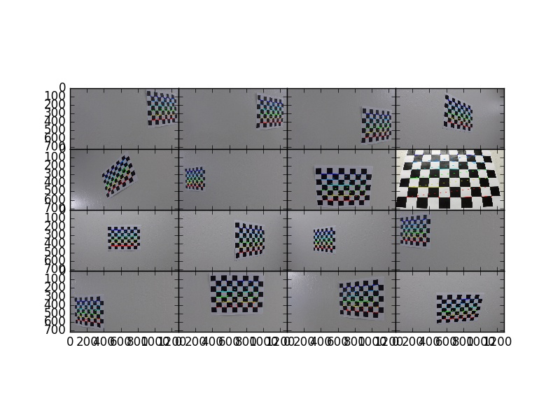
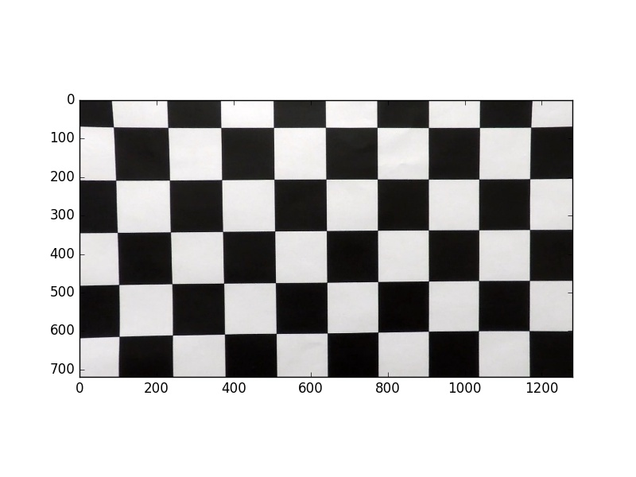
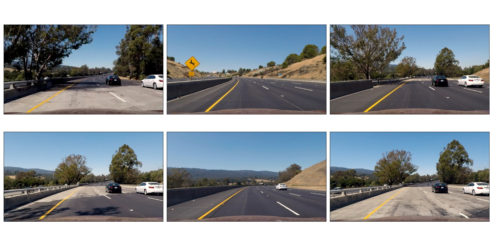
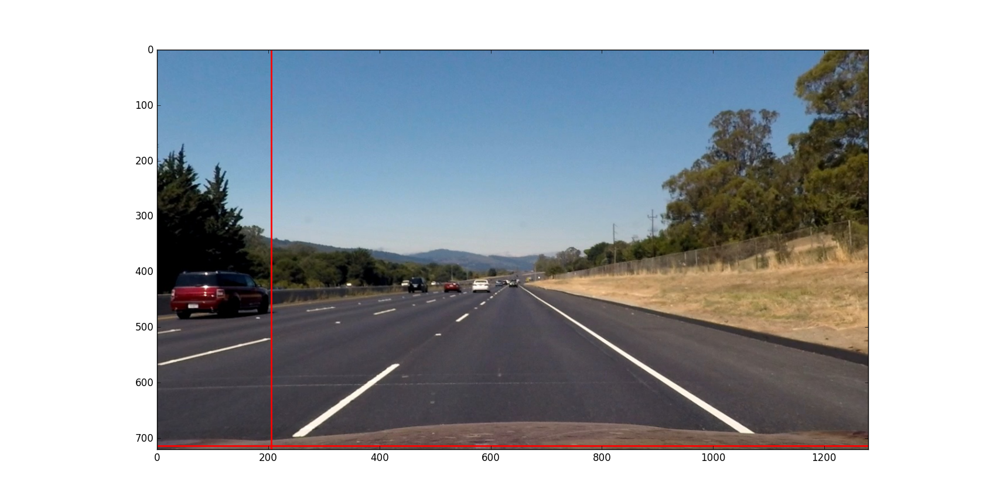
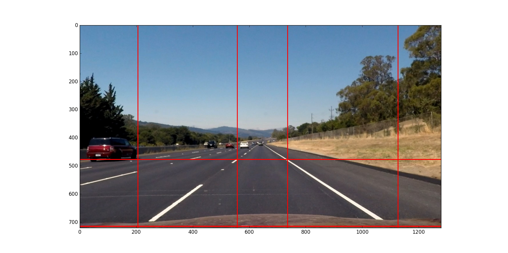
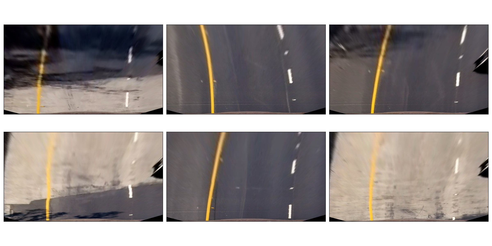
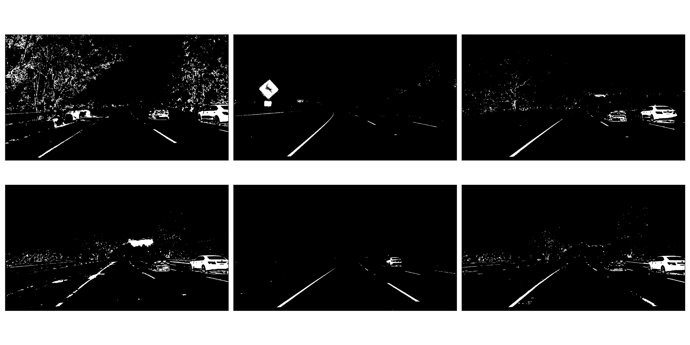
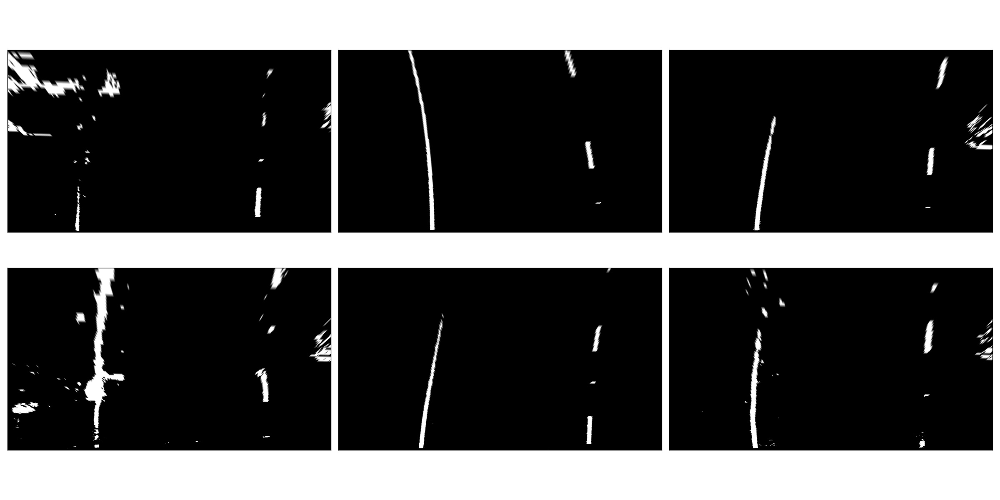
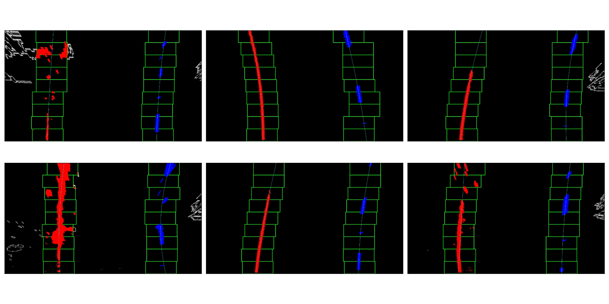
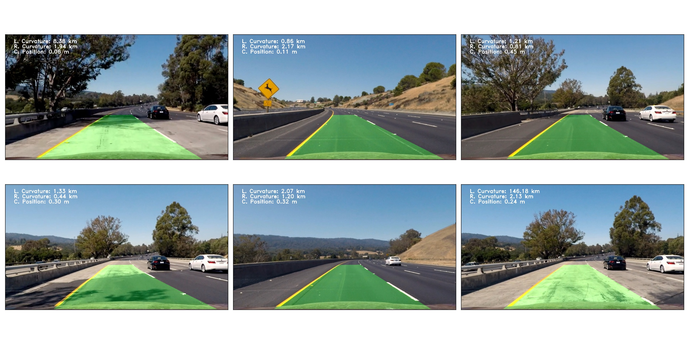

# Introduction

The goals / steps of this project are the following:

-   Compute the camera calibration matrix and distortion coefficients
    given a set of chessboard images.
-   Apply a distortion correction to raw images.
-   Use color transforms, gradients, etc., to create a thresholded
    binary image.
-   Apply a perspective transform to rectify binary image ("birds-eye
    view").
-   Detect lane pixels and fit to find the lane boundary.
-   Determine the curvature of the lane and vehicle position with
    respect to center.
-   Warp the detected lane boundaries back onto the original image.
-   Output visual display of the lane boundaries and numerical
    estimation of lane curvature and vehicle position.

## Setup

The initial setup includes creating the [Python](https://www.python.org/) environment with
the packages that the project needs and uses.

-   **[matplotlib](http://matplotlib.org/):** plotting and image processing tools
-   **[NumPy](http://www.numpy.org/):** foundational scientific computing library
-   **[MoviePy](http://zulko.github.io/moviepy/):** video processing tools
-   **[OpenCV](http://opencv.org/):** computer vision library

The [GitHub](https://github.com/) [repository](https://github.com/dventimi/CarND-Advanced-Lane-Lines) for this project contains an [environment.yml](environment.yml)
file that can be used to create and activate a [Conda](https://conda.io/docs/) environment
with these commands.

    conda env create --file environment.yml --name CarND-Advanced-Lane-Lines
    source activate CarND-Advanced-Lane-Lines

Once activated this environment is used to launch Python in
whatever way one likes, such as a [Python shell](https://www.python.org/shell/), a [IPython shell](https://ipython.org/),
or a [jupyter notebook](http://jupyter.org/).  Having done that, the usual first step is
to import the packages that are used.  

    from collections import deque
    from itertools import groupby, islice, zip_longest, cycle, filterfalse
    from moviepy.editor import VideoFileClip
    from mpl_toolkits.axes_grid1 import ImageGrid
    import cProfile
    import cv2
    import glob
    import matplotlib
    import matplotlib.image as mpimg
    import matplotlib.pyplot as plt
    import numpy as np
    import pdb

Besides the third-party packages listed above, the project also
makes use of these standard-library library packages.

-   **deque:** [ring buffers](https://en.wikipedia.org/wiki/Circular_buffer) for moving averages
-   **itertools:** handy for [Python generators](http://davidaventimiglia.com/python_generators.html)
-   **cProfile:** run-time [optimization](https://docs.python.org/2/library/profile.html)
-   **pdb:** Python [debugger](https://docs.python.org/3/library/pdb.html)

## Processing Pipeline

In order to detect lane lines in a video of a car driving on a
road, and then generate an annotated video with the detected lane
overlaid, we need an image processor that performs these two
tasks&#x2013;detection and annotation&#x2013;on every frame of the video.
That image processor encompasses a "processing pipeline."  

The pipeline depends on these preliminary tasks.

1.  Camera Calibration
2.  Perspective Measurement

Then, the pipeline applies these stages.

1.  Distortion Correction
2.  Gradient and Color Thresholds
3.  Perspective Transform
4.  Lane-line Detection

Let us examine these preliminary tasks and pipeline stages in
greater detail.

### Camera Calibration

[Camera calibration](http://docs.opencv.org/2.4/modules/calib3d/doc/camera_calibration_and_3d_reconstruction.html) measures the distortion inherent in cameras
that utilize lenses so that the images taken with the camera can
be corrected by removing the distortion.  A standard way to do
this is to measure the distortion the camera imposes on standard
images of known geometry.  Checkerboard patterns are useful for
this tasks because of their high contrast, known geometry, and
regular pattern.

The `measure_distortion` function takes a Python [sequence](https://docs.python.org/2/library/stdtypes.html#sequence-types-str-unicode-list-tuple-bytearray-buffer-xrange) of
checkerboard image filenames taken at different distances,
center-offsets, and orientations and applies the OpenCV
functions [`findChessboardCorners`](http://docs.opencv.org/2.4/modules/calib3d/doc/camera_calibration_and_3d_reconstruction.html#findchessboardcorners) and [`drawChessboardCorners`](http://docs.opencv.org/2.4/modules/calib3d/doc/camera_calibration_and_3d_reconstruction.html#drawchessboardcorners) to
identify corners in the images and highlight the corners.  Then,
the [`calibrateCamera`](http://docs.opencv.org/2.4/modules/calib3d/doc/camera_calibration_and_3d_reconstruction.html#calibratecamera) function measures the distortion.  This
function returns the distortion parameters and matrix, along
with a sequence of tuples with the original filenames and the
annotated images.

    def measure_distortion(calibration_files):
        files = calibration_files
        objp = np.zeros((9*6,3), np.float32)
        objp[:,:2] = np.mgrid[0:9,0:6].T.reshape(-1,2)
        stage1 = map(lambda x: (x,), cycle(files))
        stage2 = map(lambda x: x + (mpimg.imread(x[0]),), stage1)
        stage3 = map(lambda x: x + (cv2.findChessboardCorners(cv2.cvtColor(x[1], cv2.COLOR_RGB2GRAY), (9,6)),), stage2)
        stage4 = map(lambda x: x + (cv2.drawChessboardCorners(np.copy(x[1]), (9,6), *(x[2][::-1])),), stage3)
        filenames,images,corners,annotated_images = zip(*filter(lambda x: x[2][0], islice(stage4, len(files))))
        _,imgpoints = zip(*corners)
        objpoints = [objp for i in range(len(imgpoints))]
        ret, mtx, dist, rvecs, tvecs = cv2.calibrateCamera(objpoints, imgpoints, list(islice(stage2,1))[0][1].shape[:2:][::-1], None, None)
        return mtx, dist, zip(filenames, annotated_images)

This function is used in subsequent distortion corrections.

### Distortion Correction

The `get_undistorter` function takes a sequence of calibration
checkerboard image filenames, applies the `measure_distortion`
function, and returns a new function.  The new function function
uses the OpenCV [`undistort`](http://docs.opencv.org/2.4/modules/imgproc/doc/geometric_transformations.html#void%20undistort(InputArray%20src,%20OutputArray%20dst,%20InputArray%20cameraMatrix,%20InputArray%20distCoeffs,%20InputArray%20newCameraMatrix)) function to remove distortion from
images taken with the same camera.

    def get_undistorter(calibration_files):
        mtx,dist,annotated_images = measure_distortion(calibration_files)
        return lambda x: cv2.undistort(x, mtx, dist, None, mtx), annotated_images

In the example shown below, we get an "image undistorter"
function for a set of calibration images.

    undistort,annotated_images = get_undistorter(glob.glob("camera_cal/*.jpg"))
    fig = plt.figure()
    grid = ImageGrid(fig, 111, nrows_ncols=(4,4), axes_pad=0.0)
    
    for p in zip(annotated_images, grid):
        p[1].imshow(p[0][1])
    
    fig.savefig("output_images/annotated_calibration_images.jpg")

The annotated calibration images are shown in the figure below.

As discussed shortly, the effects of image distortion can be
subtle and difficult notice with the naked eye.  It helps
therefore to apply it to examples where the effect will be more
vivid.  The first of the camera calibration images that we
recently used to *measure* the camera distortion is a good
candidate for *correcting* distortion.  The following figure has
the original, distorted image.

It should be evident at a minimum that there is radial
distortion as the horizontal and vertical lines&#x2014;which should
be straight&#x2014;are curved outward from the center.

Next we use the camera matrix and distortion coefficients
embedded with in the `undistort` function that we obtained in
order to correct for these effects.  

    fig = plt.figure()
    plt.imshow(undistort(mpimg.imread("camera_cal/calibration1.jpg")))
    fig.savefig("output_images/undistorted_calibration1.jpg")

Next, we show the effects of applying the image undistorter to a
sequence of 6 road images taken with this same camera.  These 6
images are a test sequence that will reappear many times through
the remainder of this discussion as other image processing steps
are taken up.

The `visualize` function helps us view a gallery of test images
in "ganged up" layout, and this is helpful as we develop the
processing pipeline stages.

    def visualize(filename, a):
        fig, axes = plt.subplots(2,3,figsize=(24,12),subplot_kw={'xticks':[],'yticks':[]})
        fig.subplots_adjust(hspace=0.03, wspace=0.05)
        for p in zip(sum(axes.tolist(),[]), a):
            p[0].imshow(p[1],cmap='gray')
        plt.tight_layout()
        fig.savefig(filename)
        plt.close()

The 6 test images that we use repeatedly are shown in the figure
below, without any image processing at all.

    visualize("output_images/test_images.jpg",
              (mpimg.imread(f) for f in cycle(glob.glob("test_images/test*.jpg"))))

These test images are shown again, only this time the image
undistorter that we acquired above now is used to remove
distortion introduced by the camera.  The effect is subtle and
difficult to notice, but close inspection shows that at least a
small amount of radial distortion is removed by this process.  

    visualize("output_images/undistorted_test_images.jpg",
              (undistort(mpimg.imread(f)) for f in cycle(glob.glob("test_images/test*.jpg"))))

Next, we move on to perspective measurement.

### Perspective Measurement

Perspective measurement applies to two-dimensional images taken
of three-dimensional scenes wherein objects of
interest&#x2013;typically planar objects like roads&#x2013;are oriented such
that their [normal vector](http://mathworld.wolfram.com/NormalVector.html) is not parallel with the camera's line
of site.  Another way to put it is that the planar object is not
parallel with the [image plane](https://en.wikipedia.org/wiki/Image_plane).  While there undoubtedly are more
sophisticated, perhaps automated or semi-automated ways of doing
this, a tried-and-true method is to identify a non-rectilinear
region in the image that corresponds to the planar object of
interest (the road) and then map those to a corresponding
rectilinear region on the [image plane](https://en.wikipedia.org/wiki/Image_plane).  

The `measure_warp` function helps measure perspective.  It takes
an image as a [NumPy array](https://docs.scipy.org/doc/numpy/reference/generated/numpy.array.html) and displays the image to the user in
an interactive window.  The user only has to click four corners
in sequence for the source region and then close the interactive
window.  The destination region on the [image plane](https://en.wikipedia.org/wiki/Image_plane) for now is
hard-code to a bounding box between the top and bottom of the
image and 300 pixels from the left edge and 300 pixels from the
right edge.  These values were obtained through experimentation,
and while they are not as sophisticated as giving the user
interactive control, they do have the virtue of being perfectly
rectilinear.  This is something that is difficult to achieve
manually.  Setting the src region coordinates, along with
drawing guidelines to aid the eye, is accomplished in an
event handler function for mouse-click events.  The function
returns the transformation matrix \(M\) and the inverse
transformation matrix \(M_{inv}\).  

    def measure_warp(img):
        top = 0
        bottom = img.shape[0]
        def handler(e):
            if len(src)<4:
                plt.axhline(int(e.ydata), linewidth=2, color='r')
                plt.axvline(int(e.xdata), linewidth=2, color='r')
                src.append((int(e.xdata),int(e.ydata)))
            if len(src)==4:
                dst.extend([(300,bottom),(300,top),(980,top),(980,bottom)])
        was_interactive = matplotlib.is_interactive()
        if not matplotlib.is_interactive():
            plt.ion()
        fig = plt.figure()
        plt.imshow(img)
        global src                                                            
        global dst                                                            
        src = []
        dst = []
        cid1 = fig.canvas.mpl_connect('button_press_event', handler)
        cid2 = fig.canvas.mpl_connect('close_event', lambda e: e.canvas.stop_event_loop())
        fig.canvas.start_event_loop(timeout=-1)
        M = cv2.getPerspectiveTransform(np.asfarray(src, np.float32), np.asfarray(dst, np.float32))
        Minv = cv2.getPerspectiveTransform(np.asfarray(dst, np.float32), np.asfarray(src, np.float32))
        matplotlib.interactive(was_interactive)
        return M, Minv

Like with the `get_undistorter` function described above, we use
[Python closures](https://www.programiz.com/python-programming/closure) to create a function generator called
`get_warpers`, which measures the perspective, remembers the
transformation matrices, and then generate a new function that
uses OpenCV [`warpPerspective`](http://docs.opencv.org/2.4/modules/imgproc/doc/geometric_transformations.html#warpperspective) to transform a target image.  Note
that it actually generates two functions, both to "warp" and
"unwarp" images.

    def get_warpers(corrected_image):
        M, Minv = measure_warp(corrected_image)
        return lambda x: cv2.warpPerspective(x,
                                             M,
                                             x.shape[:2][::-1],
                                             flags=cv2.INTER_LINEAR), \
               lambda x: cv2.warpPerspective(x,
                                             Minv,
                                             x.shape[:2][::-1],
                                             flags=cv2.INTER_LINEAR), M, Minv

The following code illustrates how this is put into practice.
We get an image with the matplotlib [`imread`](http://matplotlib.org/api/image_api.html#matplotlib.image.imread) function, correct
for camera distortion using the `undistort` function we
generated with the `undistorter` function created above (after
camera calibration on checkerboard images), then use
`get_warpers` to generate both the `warp` and `unwarp`
functions.  It also returns the \(M\) and \(M_{inv}\) matrices as
`M` and `Minv` for good measure.

    warp,unwarp,M,Minv = get_warpers(undistort(mpimg.imread("test_images/straight_lines2.jpg")))

The next sequence of four figures illustrates the interactive
experience the user has in this operation, showing step-by-step
the orthogonal guidelines that appear.  The trapezoidal area
formed bout the outside bottom two corners and the inside top
two corners of the last figure defines the source region that is
then mapped to the target region.  Again, as discussed above the
target region is a rectangle running from the bottom of the
image to the top, 300 pixels in from the left edge and 300
pixels in from the right edge.

Equipped not just with an `undistort` function (obtained via
camera calibration) but also a `warp` (obtained via
perspective measurement) function, we can compose both functions
in the proper sequence (`undistort` then `warp`) and apply it to
our 6 test images.

    visualize("output_images/warped_undistorted_test_images.jpg",
              (warp(undistort(mpimg.imread(f))) for f in cycle(glob.glob("test_images/test*.jpg"))))

As you can see in the following gallery we now have a
"birds-eye" (i.e. top-down) view of the road for these 6 test
images.  Note also that the perspective transform has also had
the effect of shoving out of the frame much of the extraneous
details (sky, trees, guardrails, other cars).  This is
serendipitous as it saves us from having to apply a mask just to
the lane region.  

Camera calibration and perspective measurement are preliminary
steps that occur before applying the processing pipeline to
images taken from the video stream.  However, they are essential
and they enable the distortion correction and perspective
transformation steps which *are* part of the processing
pipeline.  Another set of essential pipeline steps involve
gradient ant color thresholds, discussed in the next sections.  

### Gradient and Color Thresholds

Next we develop a set of useful utility functions for scaling
images, taking gradients across them, isolating different color
channels, and generating binary images.

The `scale` function scales the values of NumPy image arrays to
arbitrary ranges (e.g., [0,1] or [0,255]).  The default range is
[0,255], and this is useful in order to give all images the same
scale.  Different operations (e.g., taking gradients, producing
binary images) can introduce different scales and it eases
combining and comparing images when they have the same scale.

    def scale(img, factor=255.0):
        scale_factor = np.max(img)/factor
        return (img/scale_factor).astype(np.uint8)

The `derivative` function uses the OpenCV [`sobel`](http://docs.opencv.org/2.4/modules/imgproc/doc/filtering.html#sobel) function to
apply the [Sobel operator](https://en.wikipedia.org/wiki/Sobel_operator) in order to estimate derivatives in the
\(x\) and \(y\) directions across the image.  For good measure, it
also returns both the *magnitude* and the *direction* of the
[gradient](https://en.wikipedia.org/wiki/Gradient) computed from these derivative estimates.  

    def derivative(img, sobel_kernel=3):
        derivx = np.absolute(cv2.Sobel(img, cv2.CV_64F, 1, 0, ksize=sobel_kernel))
        derivy = np.absolute(cv2.Sobel(img, cv2.CV_64F, 0, 1, ksize=sobel_kernel))
        gradmag = np.sqrt(derivx**2 + derivy**2)
        absgraddir = np.arctan2(derivy, derivx)
        return scale(derivx), scale(derivy), scale(gradmag), absgraddir

The `grad` function adapts the `derivative` function to return
both the gradient *magnitude* and *direction*.  You might wonder
what this function adds to the `derivative` function, and that
is a valid consideration.  Largely it exists because the lecture
notes seemed to suggest that it's worthwhile to use different
kernel sizes for the Sobel operator when computing the gradient
direction.  In hindsight it's not clear this function really is
adding value and it may be removed in future versions.

    def grad(img, k1=3, k2=15):
        _,_,g,_ = derivative(img, sobel_kernel=k1)
        _,_,_,p = derivative(img, sobel_kernel=k2)
        return g,p

The `hls_select` function is a convenience that fans out the
three channels of the [HLS color-space](https://en.wikipedia.org/wiki/HSL_and_HSV) into separate NumPy
arrays.  

    def hls_select(img):
        hsv = cv2.cvtColor(img, cv2.COLOR_RGB2HLS).astype(np.float)
        h = hsv[:,:,0]
        l = hsv[:,:,1]
        s = hsv[:,:,2]
        return h,l,s

The `rgb_select` function is another convenience that returns
the three channels of the [RGB color-space](https://en.wikipedia.org/wiki/RGB_color_space).

    def rgb_select(img):
        rgb = img
        r = rgb[:,:,0]
        g = rgb[:,:,1]
        b = rgb[:,:,2]
        return r,g,b

The `threshold` function is a convenience that applies
`thresh_min` and `thresh_max` *min-max* values and logical
operations in order to obtain "binary" images.  Binary images
have activated pixels (non-zero values) for desired features.

    def threshold(img, thresh_min=0, thresh_max=255):
        binary_output = np.zeros_like(img)
        binary_output[(img >= thresh_min) & (img <= thresh_max)] = 1
        return binary_output

The `land` and `lor` functions are conveniences for combining
binary images, either with logical [conjunction](https://en.wikipedia.org/wiki/Logical_conjunction) or [disjunction](https://en.wikipedia.org/wiki/Logical_disjunction),
respectively.  

    land = lambda *x: np.logical_and.reduce(x)
    lor = lambda *x: np.logical_or.reduce(x)

There are various ways of doing this.  Another way is to stack
binary image arrays using the NumPy [`stack`](https://docs.scipy.org/doc/numpy/reference/generated/numpy.stack.html) function and then
interleave various combinations of such interleavings along with
the NumPy [`any`](https://docs.scipy.org/doc/numpy/reference/generated/numpy.any.html#numpy-any) function and [`all`](https://docs.scipy.org/doc/numpy/reference/generated/numpy.all.html#numpy-all) function.  It's a clever
approach, but I find that applying the NumPy [`logical_and`](https://docs.scipy.org/doc/numpy/reference/generated/numpy.logical_and.html#numpy-logical-and) and
[`logical_or`](https://docs.scipy.org/doc/numpy/reference/generated/numpy.logical_or.html#numpy-logical-or) functions as above leads to less typing.  

The `highlight` function composes the color channel selection,
gradient estimation, binary threshold, logical composition, and
scaling operations to an input image in order to "highlight" the
desired features, such as lane lines.  Note that distortion
correction and perspective transformation are considered outside
the scope of this function.  In a real pipeline, those two
operations almost certainly should be applied to an image before
presenting it to the `highlight` function.  In general, they
need not be, which can be useful during the exploratory phase of
pipeline development.

    def highlight(img):
        r,g,b = rgb_select(img)
        h,l,s = hls_select(img)
        o01 = threshold(r, 200, 255)
        o02 = threshold(g, 200, 255)
        o03 = threshold(s, 200, 255)
        return scale(lor(land(o01,o02),o03))

In fact, the highlight and undistort operations are combined
*without* perspective transform in the next gallery of 6 test
images.  This is an example of a common iteration pattern while
exploring pipeline options.

    visualize("output_images/binary_undistorted_test_images.jpg",
              (highlight(undistort(mpimg.imread(f))) for f in cycle(glob.glob("test_images/test*.jpg"))))

### Perspective Transform

Armed with a pipeline which, based on the 6 test images, we
believe may be a good candidate for detecting lane lines, we
then see what the pipeline-processed test images look like after
transforming them to a "bird's-eye" view.

    visualize("output_images/warped_binary_undistorted_images.jpg",
              (warp(highlight(undistort(mpimg.imread(f)))) for f in cycle(glob.glob("test_images/test*.jpg"))))

### Lane-Finding

Lane-line detection can be done somewhat laboriously&#x2013;but
perhaps more accurately&#x2013;using a "sliding window" technique.
Roughly, the algorithm implemented in
`detect_lines_sliding_window` below has these steps, also
discussed in the code comments.

1.  Take a histogram across the bottom of the image.
2.  Find the histogram peaks to identify the lane lines at the
    bottom of the image.
3.  Divide the image into a vertical stack of narrow horizontal
    slices.
4.  Select activated pixels (remember, the input is a binary
    image) only in a "neighborhood" of our current estimate of
    the lane position.  This neighborhood is the "sliding
    window."  To bootstrap the process, our initial estimate of
    the lane line location is taken from the histogram peak steps
    listed above.  Essentially, we are removing "outliers"
5.  Estimate the new lane-line location for this window from the
    mean of the pixels falling within the sliding window.
6.  March vertically up through the stack, repeating this process.
7.  Select all activated pixels within all of our sliding windows.
8.  Fit a quadratic function to these selected pixels, obtaining
    model parameters.

The model parameters essentially represent the detected
lane-line.  We do this both for the left and right lines.
Moreover, we also perform a few somewhat ancillary operations
while we're at it.

1.  Draw the sliding windows, the selected pixels, and the
    modeled quadratic curve onto a copy of the image.
2.  Recompute the function fit after scaling the pixel locations
    to real world values, then use these model fit parameters to
    compute a real-world radius of curvature for both lanes.

The function `detect_lines_sliding_window` returns quite a few values:

1.  left lane fit parameters
2.  right lane fit parameters
3.  left lane fit residuals
4.  right lane fit residuals
5.  left lane real-world radius (in meters)
6.  right lane real-world radius (in meters)
7.  annotated image, with sliding windows, selected pixels, and
    modeled curves

The code for this function is shown here. 

    def detect_lines_sliding_window(warped_binary):
        # Assuming you have created a warped binary image called "warped_binary"
        # Take a histogram of the bottom half of the image
        histogram = np.sum(warped_binary[warped_binary.shape[0]/2:,:], axis=0)
        # Create an output image to draw on and  visualize the result
        out_img = np.dstack((warped_binary, warped_binary, warped_binary))*255
        # Find the peak of the left and right halves of the histogram
        # These will be the starting point for the left and right lines
        midpoint = np.int(histogram.shape[0]/2)
        leftx_base = np.argmax(histogram[:midpoint])
        rightx_base = np.argmax(histogram[midpoint:]) + midpoint
        # Choose the number of sliding windows
        nwindows = 9
        # Set height of windows
        window_height = np.int(warped_binary.shape[0]/nwindows)
        # Identify the x and y positions of all nonzero pixels in the image
        nonzero = warped_binary.nonzero()
        nonzeroy = np.array(nonzero[0])
        nonzerox = np.array(nonzero[1])
        # Current positions to be updated for each window
        leftx_current = leftx_base
        rightx_current = rightx_base
        # Set the width of the windows +/- margin
        margin = 100
        # Set minimum number of pixels found to recenter window
        minpix = 50
        # Create empty lists to receive left and right lane pixel indices
        left_lane_inds = []
        right_lane_inds = []
        # Step through the windows one by one
        for window in range(nwindows):
            # Identify window boundaries in x and y (and right and left)
            win_y_low = warped_binary.shape[0] - (window+1)*window_height
            win_y_high = warped_binary.shape[0] - window*window_height
            win_xleft_low = leftx_current - margin
            win_xleft_high = leftx_current + margin
            win_xright_low = rightx_current - margin
            win_xright_high = rightx_current + margin
            # Draw the windows on the visualization image
            cv2.rectangle(out_img,(win_xleft_low,win_y_low),(win_xleft_high,win_y_high),(0,255,0), 2) 
            cv2.rectangle(out_img,(win_xright_low,win_y_low),(win_xright_high,win_y_high),(0,255,0), 2) 
            # Identify the nonzero pixels in x and y within the window
            good_left_inds = ((nonzeroy >= win_y_low) & (nonzeroy < win_y_high) & (nonzerox >= win_xleft_low) & (nonzerox < win_xleft_high)).nonzero()[0]
            good_right_inds = ((nonzeroy >= win_y_low) & (nonzeroy < win_y_high) & (nonzerox >= win_xright_low) & (nonzerox < win_xright_high)).nonzero()[0]
            # Append these indices to the lists
            left_lane_inds.append(good_left_inds)
            right_lane_inds.append(good_right_inds)
            # If you found > minpix pixels, recenter next window on their mean position
            if len(good_left_inds) > minpix:
                leftx_current = np.int(np.mean(nonzerox[good_left_inds]))
            if len(good_right_inds) > minpix:        
                rightx_current = np.int(np.mean(nonzerox[good_right_inds]))
        # Concatenate the arrays of indices
        left_lane_inds = np.concatenate(left_lane_inds)
        right_lane_inds = np.concatenate(right_lane_inds)
        # Extract left and right line pixel positions
        leftx = nonzerox[left_lane_inds]
        lefty = nonzeroy[left_lane_inds] 
        rightx = nonzerox[right_lane_inds]
        righty = nonzeroy[right_lane_inds] 
        # Fit a second order polynomial to each
        left_fit,left_res,_,_,_ = np.polyfit(lefty, leftx, 2, full=True)
        right_fit,right_res,_,_,_ = np.polyfit(righty, rightx, 2, full=True)
        # Generate x and y values for plotting
        ploty = np.linspace(0, warped_binary.shape[0]-1, warped_binary.shape[0] )
        left_fitx = left_fit[0]*ploty**2 + left_fit[1]*ploty + left_fit[2]
        right_fitx = right_fit[0]*ploty**2 + right_fit[1]*ploty + right_fit[2]
        out_img[nonzeroy[left_lane_inds], nonzerox[left_lane_inds]] = [255, 0, 0]
        out_img[nonzeroy[right_lane_inds], nonzerox[right_lane_inds]] = [0, 0, 255]
        out_img[ploty.astype('int'),left_fitx.astype('int')] = [0, 255, 255]
        out_img[ploty.astype('int'),right_fitx.astype('int')] = [0, 255, 255]
        y_eval = warped_binary.shape[0]
        # Define conversions in x and y from pixels space to meters
        ym_per_pix = 30/720 # meters per pixel in y dimension
        xm_per_pix = 3.7/700 # meters per pixel in x dimension
        # Fit new polynomials to x,y in world space
        left_fit_cr = np.polyfit(lefty*ym_per_pix, leftx*xm_per_pix, 2)
        right_fit_cr = np.polyfit(righty*ym_per_pix, rightx*xm_per_pix, 2)
        # Calculate the new radii of curvature
        left_curverad = ((1 + (2*left_fit_cr[0]*y_eval*ym_per_pix + left_fit_cr[1])**2)**1.5) / np.absolute(2*left_fit_cr[0])
        right_curverad = ((1 + (2*right_fit_cr[0]*y_eval*ym_per_pix + right_fit_cr[1])**2)**1.5) / np.absolute(2*right_fit_cr[0])
        return left_fit, right_fit, np.sqrt(left_fit[1]/len(leftx)), np.sqrt(right_fit[1]/len(rightx)), left_curverad, right_curverad, out_img

The following figures shows the annotated image resulting from
applying this particular lane-finding algorithm to our 6 test
images, after distortion correction, highlighting, and
perspective transformation.

    visualize("output_images/detected_lines_test_images.jpg",
              (detect_lines_sliding_window(warp(highlight(undistort(mpimg.imread(f)))))[6] for f in cycle(glob.glob("test_images/test*.jpg"))))

Armed with a good estimate for the current lane-line locations
and with the observation that the lanes do not change
dramatically from one frame to the next, we can implement an
optimization.  Recall that the *only reason* for the sliding
window algorithm is to remove outliers.  If we were content just
to fit all of the pixels, good or bad, we would only need to
divide the frame into a left half and a right half and then fit
the quadratic curves straight away.  However, guided by the
lecture we chose to remove outliers.  That requires a good guess
for where the lane line is, which almost inevitably leads us to
the sliding window technique.

The `detect_lines` function takes `left_fit` and `right_fit`
arguments, which are good estimates of the model fit parameters
obtained from the previous video frame.  It then selects pixels
in the neighborhood of the curve computed for these parameters,
and fits new parameters for the current frame from the selected
pixels.  Thus, it avoids the labor of the sliding window
technique so long as one already has a good estimate of the
model fit parameters.  Note that, because this function does
*not* apply the sliding window technique, it cannot draw the
sliding windows.  Therefore, the last parameter returned is
`None`.  

    def detect_lines(warped_binary, left_fit, right_fit):
        # from the next frame of video (also called "binary_warped")
        # It's now much easier to find line pixels!
        nonzero = warped_binary.nonzero()
        nonzeroy = np.array(nonzero[0])
        nonzerox = np.array(nonzero[1])
        margin = 100
        left_lane_inds = ((nonzerox > (left_fit[0]*(nonzeroy**2) + left_fit[1]*nonzeroy + left_fit[2] - margin)) & (nonzerox < (left_fit[0]*(nonzeroy**2) + left_fit[1]*nonzeroy + left_fit[2] + margin))) 
        right_lane_inds = ((nonzerox > (right_fit[0]*(nonzeroy**2) + right_fit[1]*nonzeroy + right_fit[2] - margin)) & (nonzerox < (right_fit[0]*(nonzeroy**2) + right_fit[1]*nonzeroy + right_fit[2] + margin)))  
        # Again, extract left and right line pixel positions
        leftx = nonzerox[left_lane_inds]
        lefty = nonzeroy[left_lane_inds] 
        rightx = nonzerox[right_lane_inds]
        righty = nonzeroy[right_lane_inds]
        # Fit a second order polynomial to each
        left_fit,left_res,_,_,_ = np.polyfit(lefty, leftx, 2, full=True)
        right_fit,right_res,_,_,_ = np.polyfit(righty, rightx, 2, full=True)
        # Generate x and y values for plotting
        ploty = np.linspace(0, warped_binary.shape[0]-1, warped_binary.shape[0] )
        left_fitx = left_fit[0]*ploty**2 + left_fit[1]*ploty + left_fit[2]
        right_fitx = right_fit[0]*ploty**2 + right_fit[1]*ploty + right_fit[2]
        y_eval = warped_binary.shape[0]
        # Define conversions in x and y from pixels space to meters
        ym_per_pix = 30/720 # meters per pixel in y dimension
        xm_per_pix = 3.7/700 # meters per pixel in x dimension
        # Fit new polynomials to x,y in world space
        left_fit_cr = np.polyfit(lefty*ym_per_pix, leftx*xm_per_pix, 2)
        right_fit_cr = np.polyfit(righty*ym_per_pix, rightx*xm_per_pix, 2)
        # Calculate the new radii of curvature
        left_curverad = ((1 + (2*left_fit_cr[0]*y_eval*ym_per_pix + left_fit_cr[1])**2)**1.5) / np.absolute(2*left_fit_cr[0])
        right_curverad = ((1 + (2*right_fit_cr[0]*y_eval*ym_per_pix + right_fit_cr[1])**2)**1.5) / np.absolute(2*right_fit_cr[0])
        return left_fit, right_fit, np.sqrt(left_fit[1]/len(leftx)), np.sqrt(right_fit[1]/len(rightx)), left_curverad, right_curverad, None

Note in the function above how the radius of curvature is
calculated for the two lanes.  First, constants establish a
conversion between pixel coordinates in the \(x\) and \(y\)
directions and corresponding real-world coordinates (in meters)
in the \(x\) and \(z\) direction.  By \(z\) direction I mean depth
into the frame.  This is an important point, because we must
account for the fact that the three-dimensional real-world image
has been warped by the perspective transform into a
two-dimensional pixel-space image.  Second, we fit our model
again, this time after converting our pixel coordinates into
real-world values.  This is important!  A simple conversion of
radius-of-curvature estimates taken from our original fit would
not be correct, because that fit does not account for the
warping between the three-dimensional real world and the
two-dimensional pixel-space of the image plane.  Third, for the
left and right lanes we calculate the radius of curvature using
the model fit parameters, according to this formula, where \(A\)
and \(B\) are fit parameters.

\[ R_{curve} = \frac{\left(1 + \left(2 A y +
      B\right)^2\right)^{3/2}}{\left| 2 A \right|} \]

The `draw_lane` function takes a distortion-corrected unwarped
image, a warped binary image like, model fit parameters,
real-world lane-curvature estimates in meters, and an image
unwarping function.  It uses these to annotate the undistorted
image with a depiction of the lane, along with vital statistics
on the left and right lane curvature, and the position of the
camera with respect to the center of the lane (taken as the mean
of the two lane locations).

    def draw_lane(undistorted, warped_binary, l_fit, r_fit, l_rad, r_rad, unwarp):
        # Create an image to draw the lines on
        warp_zero = np.zeros_like(warped_binary).astype(np.uint8)
        color_warp = np.dstack((warp_zero, warp_zero, warp_zero))
        # Generate x and y values for plotting
        ploty = np.linspace(0, warped_binary.shape[0]-1, warped_binary.shape[0])
        l_fitx = l_fit[0]*ploty**2 + l_fit[1]*ploty + l_fit[2]
        r_fitx = r_fit[0]*ploty**2 + r_fit[1]*ploty + r_fit[2]
        # Recast the x and y points into usable format for cv2.fillPoly()
        pts_left = np.array([np.transpose(np.vstack([l_fitx, ploty]))])
        pts_right = np.array([np.flipud(np.transpose(np.vstack([r_fitx, ploty])))])
        pts = np.hstack((pts_left, pts_right))
        # Draw the lane onto the warped_binary blank image
        cv2.fillPoly(color_warp, np.int_([pts]), (0,255, 0))
        # Warp the blank back to original image space using inverse perspective matrix (Minv)
        # newwarp = cv2.warpPerspective(color_warp, Minv, (image.shape[1], image.shape[0])) 
        newwarp = unwarp(color_warp)
        # Combine the result with the original image
        result = cv2.addWeighted(undistorted, 1, newwarp, 0.3, 0)
        # Annotate image with lane curvature estimates
        cv2.putText(result, "L. Curvature: %.2f km" % (l_rad/1000), (50,50), cv2.FONT_HERSHEY_DUPLEX, 1, (255,255,255), 2)
        cv2.putText(result, "R. Curvature: %.2f km" % (r_rad/1000), (50,80), cv2.FONT_HERSHEY_DUPLEX, 1, (255,255,255), 2)
        # Annotate image with position estimate
        cv2.putText(result, "C. Position: %.2f m" % ((np.average((l_fitx + r_fitx)/2) - warped_binary.shape[1]//2)*3.7/700), (50,110), cv2.FONT_HERSHEY_DUPLEX, 1, (255,255,255), 2)
        return result

Note in the function above how we annotate the image with an
estimate of the position of the car with respect to the center
of the road.  It is a simple average of the pixel coordinates of
the two lanes at the bottom of the image, minus the pixel
coordinate of the image center, then scaled to a real-world
value (meters).  Note that we do *not* need the second curve fit
in real-world coordinates that was done in the two
lane-detecting functions to do this.  Because we are estimating
the position at the *bottom* of the image frame, the horizontal
direction only comes into play and we only need account for \(x\)
coordinates.  We had to perform the second fit for the radius of
curvature calculation to compensate for the warping of the
image, but that warping *only* relates the \(z\) direction in the
three-dimensional world and the \(y\) direction in the image
plane.  It plays no role in calculating the car position, but
*only* if we assume that position is to be taken at the bottom
of the image.

Note also that as we annotate the image with the radius of
curvature for the left and right lanes, we divide the
distances, which were calculated in meters, by a factor of 1000
in order to present them in kilometers.  Given the geometry of
the problem and the distances involved, I argue that kilometers
and not meters are the natural scale length.  Distances in
meters can be provided upon request, or simply calculated in the
reader's head.

With those notes, finally we can move on to the full processing
pipeline.  

The `get_processor` function returns a "processor" function.  A
processor function embodies *all* of the steps of the pipeline
outlined above:

1.  Distortion Correction
2.  Perspective Transformation
3.  Lane-line detection *with* bootstrapping
4.  Radius of curvature and vehicle position calculations
5.  Image annotation with drawn lane lines and vital statistics

One other thing that this function does is this.  It takes a
weighted average of some number of recent frames, along with the
current frame.  This removes "jitter" from the lanes and values
on the video streams, and adds robustness against bad detections
on individual frames.  It uses `dequeue` to create "ring
buffers" for the left lane parameters, right lane parameters,
left lane radius, and right lane radius.  The buffers can be of
any size, though the default has 10 slots.  Note that a buffer
size of 1 essentially computes no average at all.  Weighted
averages are taken across these buffers.  The weights could be
taken from any function, simple or complex, that is appropriate
for the situation.  In practice I did not try for anything
complicated, and used a simple linear weighting scheme:  older
frames have strictly linearly less weight.

    def get_processor(nbins=10):
        bins = nbins
        l_params = deque(maxlen=bins)
        r_params = deque(maxlen=bins)
        l_radius = deque(maxlen=bins)
        r_radius = deque(maxlen=bins)
        weights = np.arange(1,bins+1)/bins
        def process_image(img0):
            undistorted = undistort(img0)
            warped_binary = warp(highlight(undistorted))
            l_fit, r_fit, l_res, r_res, l_curverad, r_curverad, _ = detect_lines_sliding_window(warped_binary) if len(l_params)==0 else detect_lines(warped_binary,np.average(l_params,0,weights[-len(l_params):]), np.average(r_params,0,weights[-len(l_params):]))
            l_params.append(l_fit)
            r_params.append(r_fit)
            l_radius.append(l_curverad)
            r_radius.append(r_curverad)
            annotated_image = draw_lane(undistorted,
                                        warped_binary,
                                        np.average(l_params,0,weights[-len(l_params):]),
                                        np.average(r_params,0,weights[-len(l_params):]),
                                        np.average(l_radius,0,weights[-len(l_params):]),
                                        np.average(r_radius,0,weights[-len(l_params):]),
                                        unwarp)
            return annotated_image
        return process_image

Equipped with a bona-fide image processor, the very one we use
on the video stream we can examine its effect on our 6 test images.

    visualize("output_images/drawn_lanes_test_images.jpg", 
              (get_processor(1)(mpimg.imread(f)) for f in cycle(glob.glob("test_images/test*.jpg"))))

Finally, generate a new processor and apply it to the video
stream.  We generate a new processor in order to give it a
different buffer size for the ring buffers supporting the
weighted averages.  For the video stream, the ring buffers have
50 slots, not 10.  Since the video stream is at 25 frames per
second, this constitutes a full 2 second window for the weighted
average.  That may seem like a lot, and we *do* have to be
careful not to push it too far.  There is a trade-off between
the smoothness and robustness added by the weighted average, and
a stiffness to the model that may cause it to lag on sharp
turns.  In practice, however, the weighted average quickly
deweights older frames, and in experimentation no deleterious
effects were noticed with a set of 50-slot ring buffers.

    in_clip = VideoFileClip("project_video.mp4")
    out_clip = in_clip.fl_image(get_processor(50))
    cProfile.run('out_clip.write_videofile("output_images/project_output.mp4", audio=False)', 'restats')

Processing the project video with this pipeline produces [this
video](https://youtu.be/xuDNjYzcjzs) with the lanes detected and drawn, and the radius of
curvature estimates and car positions added.

<iframe width="800" height="450" src="https://www.youtube.com/embed/xuDNjYzcjzs" frameborder="0" allowfullscreen></iframe>

## Discussion

This was a *very* challenging project, perhaps the most
challenging so far in this course.  

### What Worked Well

-   Alternate Color-Spaces

    If the reader refers back to the `highlight` function
    described above, and which is a key function that combines
    various aspects of image analysis together in order to
    highlight the lane lines, he or she should notice certain
    things.  In particular, it only uses color-spaces:  RBG and
    HLS, and within those, only certain channels.  
    
    In the exploratory phase of this project, it seemed that in
    the RGB color-space, the Red (R) and Green (G) colors
    independently were somewhat effective in picking out lane
    lines and better when combined with an *AND* operation.  This
    surprised me somewhat, and still warrants further
    investigation.  The drawback was that while these channels
    worked well in good lighting conditions, they performed poorly
    in shadows.  
    
    Moreover, the Saturation (S) channel in the HLS color-space
    also was *very* effective in highlighting lines under various
    lighting conditions.  Its drawback is that it highlights too
    many other features as well, like other cars and
    discolorations on the road.  
    
    Finally, slicing out and applying thresholds to color-spaces
    seems to be a relatively inexpensive operation
    computationally, which is important for rapid iteration.

-   Color Thresholding

    Naturally, along with both color and gradient computation one
    typically will apply a threshold in order to obtain a binary
    image with "activated" pixels associated with lane-lines.
    This worked well, of course, but more important judicious use
    of thresholds was somewhat effective in mitigating the
    spurious features that the color-spaces brought in, such as
    road discolorations.

-   Perspective Transform

    Of course, performing a perspective transform to a bird's-eye
    view is almost a necessary component of a project like this.
    However, it also had another unexpected benefit.  As alluded
    to above, it naturally shoves portions of the image outside of
    the trapezoidal source region *outside* the frame when the
    transform is applied.  I had anticipated a need for a masking
    operation on the image, but found that I did not need it as
    the perspective transform naturally did most or all of the
    masking for me.  

-   Lane Detection

    I adapted both the sliding window and non-sliding window lane
    detection algorithms almost exactly as they were presented in
    the lecture notes, and they worked perfectly, without a
    hitch.  

-   Radius-of-Curvature and Car Position Calculation

    Likewise, I applied the radius-of-curvature calculation almost
    exactly as presented in the lecture material, and it also
    worked well.  As for the car position calculation, it turned
    out to be quite trivial. 

-   Buffering

    Using a ring-buffer with the Python [`deque`](https://docs.python.org/2/library/collections.html#collections.deque) data structure
    along with the Numpy [`average`](https://docs.scipy.org/doc/numpy/reference/generated/numpy.average.html#numpy-average) function made it *very* easy to
    implement a weighted average over some number of previous
    frames.  Not only did this smooth out the line detections,
    lane drawings, and distance calculations, it also had the
    added benefit of significantly increasing the robustness of
    the whole pipeline.  Without buffering&#x2014;and without a
    mechanism for identifying and discarding bad detections&#x2014;the
    lane would often bend and swirl in odd directions as it became
    confused by spurious data from shadows, road discolorations,
    etc.  With buffering **almost** all of that went away, even
    without discarding bad detections.  If you pay close attention
    to the video, near the very end at around the 48s mark, the
    drawn lane is slightly attracted to and bends slightly toward
    the black car that is passing on the right.  Without
    buffering, this was a significant problem.  With more work on
    the combination of gradient and color thresholds and perhaps
    by discarding bad detections this problem would have been
    eliminated.  However, I found that most of it could be
    banished simply with buffering.  

-   Python Generators

    I continue to be pleased with the ease of composition in a
    functional style that is enabled by use of [Python generators](http://davidaventimiglia.com/python_generators.html).
    Wrapping generators for filenames, images, and the output of
    other functions in the [`cycle`](https://docs.python.org/3/library/itertools.html#itertools.cycle) generator from [itertools](https://docs.python.org/3/library/itertools.html) was a
    mainstay, especially for the 6 test images.  This was because
    I could cycle through the processed images either one by one,
    or in batches of 6, right in the Python interpreter.  It was
    very effective for debugging. 

### What Did Not Work Well

-   Gradient Thresholding

    I found it very difficult to coax much usable signal out of
    the gradient calculations and was grateful that I could get by
    without them.
    
    Moreover, the gradient calculations I was performing added
    *significant* computational overhead.  With gradient
    thresholding and color thresholding it took approximately 15
    minutes to process the project video.  With just color
    thresholding I cut that time by a third, down to just 5
    minutes.  No doubt some of this is do to the `arctan2`
    function that computes the gradient direction, since `arctan2`
    is known to be an expensive operation.  Nevertheless, the
    profiler that I used did show significant time spent just in
    the `sobel` operation as well.

### What Could Be Improved

-   Gradient and Color Thresholding

    There is almost as much art as there is science in
    highlighting the lane lines (and *just* the lane lines)
    robustly, in a wide range of conditions.  There are many
    hyper-parameters and many many ways to combine these
    operations.  I spent considerable time on this aspect of the
    project yet never stumbled upon a "magic" combination that
    worked very well in all conditions.  At present I have settled
    for simple combination of color thresholds with no gradients
    and only middling performance.  I'm sure I can do better.

-   Discarding Bad Detections

    I started down the path of discarding bad line detections,
    which is why I adapted the Numpy [`polyfit`](https://docs.scipy.org/doc/numpy/reference/generated/numpy.polyfit.html#numpy-polyfit) function to return
    residuals, but on the project video at least I found that with
    buffering I did not need to do this.  Nevertheless, I think it
    would be prudent to add it in order to make the pipeline more
    robust.  

-   Code Refactoring

    There is a great deal of code duplication, especially between
    the `detect_lines_sliding_window` and `detect_lines`
    functions.  Also, the car position calculation probably should
    not be performed in the `draw_lane` function.  These blemishes
    are far from fatal and removing them is not part of the
    project, but they make that part of the code unwieldy,
    difficult to maintain, and somewhat difficult to read.  I
    would definitely refactor this portion of the code in
    subsequent revisions.  

-   Measuring Perspective

    As discussed above, the target region for the perspective
    transform is hard-coded to be a rectangle from the bottom of
    the image to the top, 300 pixels in from the left edge and 300
    pixels in from the right edge.  While this worked well in the
    end, it only was brought about by trial-and-error, and is not
    very flexible.  It would be better to adapt the `measure_warp`
    function so that the user has more freedom in specifying this
    region.
